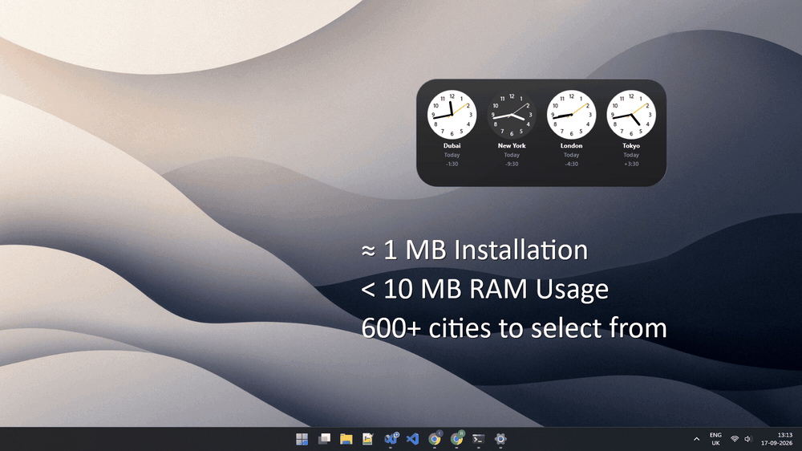

# WTick
### World Clock Widget for the Windows Desktop

Up to six analog clocks on your desktop, each showing the time in a city you choose, together on one
pane of dark glass. Every dial follows its city's real sunrise and sunset, so a city in daylight is
light and one at night is dark. Around 1 MB, under 10 MB of RAM, twenty languages, no telemetry, no
internet needed.

---

## 🎬 Preview

## ✨ Features

- **Six Cities at Once** - Over 600 cities covering all 141 Windows time zones; search by city or country
- **Day & Night Dials** - Light dial with black hands while the sun is up there, dark dial with white hands after it sets, computed from the city's coordinates and the current instant
- **Two Views** - *Compact* packs the dials into a grid with a short city code inside each face; *Expanded* lines them up with the city name, whether it is yesterday, today or tomorrow there, and the offset from your own clock
- **Animated Throughout** - Switching views, adding, removing and reordering cities all glide into place
- **Frameless & Transparent** - Dark-glass frame on your wallpaper, no window chrome. It fades to a quiet tint when another app takes focus, and returns to full contrast when you come back
- **Drag Anywhere** - Grab it and move it; position and size are remembered
- **Scale From Widget to Wall** - *Resize* from the right-click menu puts a grip in the corner; drag it to any size
- **Show Seconds** - Orange second hand on or off, your choice
- **Survives Win+D** - Stays where you put it, even after Show Desktop
- **Start with Windows** *(optional)*
- **System Tray Icon** *(optional)* - Same menu, from the notification area
- **High-DPI Sharp** - Rescales cleanly across monitors and DPI boundaries
- **20 Languages** - Matched automatically to your Windows display language, city and country names included
- **Correct Through DST Changes** - Offsets and daylight-saving rules come from Windows' own time zone database
- **Native & Tiny** - Software Direct2D. No frameworks, no background services, no runtime to install
- **No Telemetry** - Nothing collected, nothing sent, no account, no internet needed

---

## 📥 Download

WTick is available from the Microsoft Store only - it installs, updates and stays signed like any
other Store app.

- Purchasing from the Microsoft Store helps support ongoing development ❤️
- You can also support via GitHub Sponsors: 

---

## 🚀 Installation

[**Install from Microsoft Store**](https://apps.microsoft.com/detail/9P039TR9SW9S?launch=true&cid=from_github&mode=full)

There is no portable build and no GitHub release at the moment.

---

## ⚙️ Settings

The right-click menu is the whole interface:

- **Expanded view** - Show the city, day and offset under each dial
- **Show seconds** - Second hand on or off
- **Customize...** - Pick the cities: the pencil changes one, the wastebasket removes one, and the grip on the right reorders by dragging - the widget rearranges as you drag. Changes apply instantly; there is no OK button
- **Resize** - Turns on the grip at the bottom-right corner; drag it to scale, then click away
- **Start with Windows**
- **Show in system tray**
- **About WTick...**
- **Exit**

Drag the widget itself to move it.

Everything is saved to `%LOCALAPPDATA%\WTick.ini`, which is plain text and hand-editable. *Start with
Windows* is the one exception - it is a value under `HKCU\...\CurrentVersion\Run`, because Windows is
what reads it, so Task Manager's Startup tab can turn it off too.

---

## 🌓 Day and Night

A dial is light while the sun is actually above the horizon at that city, and dark otherwise -
computed from the city's coordinates and the current instant, not from a fixed hour. Sunrise here
means the standard one, the moment the sun's upper limb appears, so it agrees with whatever almanac
or weather app you check it against.

Above the Arctic and Antarctic circles it does what the sky does: a city in polar summer stays light
for the whole twenty-four hours, and one in polar winter stays dark.

---

## 📌 Requirements

- Windows 10 or Windows 11 - x64, ARM64 or x86
- No .NET, no Visual C++ redistributable, no runtime of any kind

---

## 🌍 Translations

Twenty languages: Arabic, Chinese (Simplified & Traditional), Dutch, English, Finnish, French,
German, Hungarian, Italian, Japanese, Korean, Malayalam, Polish, Portuguese (Brazil & Portugal),
Russian, Spanish, Swedish, Ukrainian.

The interface follows your Windows **display language**, which is a different setting from your
regional format. A regional variant uses its language's closest translation, so Austrian German gets
German and Hong Kong Chinese gets Traditional Chinese. City and country names are translated too, and
the city picker searches both English and your language.

Spotted a translation that reads wrong? [Open an issue](https://github.com/riyasy/WTick/issues) with
the language and the better wording.

---

## 🔒 Privacy

Nothing is collected, nothing is sent. There is no account, no telemetry, and no internet connection
required - not even an update check.

---

## 🛠️ Roadmap

- More cities and more languages
- Digital faces alongside the analog dials

---

## 💬 Feedback

Bug reports and feature requests are welcome on the [issue tracker](https://github.com/riyasy/WTick/issues).
The source code is not published here yet; this repository is the public home for the docs and issues.

---

## 💡 Tip

Park it in a corner in **Compact** view - it stays visible on the desktop, out of the way of your
windows, and Win+D never loses it.

---

## 📄 Licence

See [`LICENSE`](LICENSE): GPL-3.0 for the source code, with separate terms for the binaries and the
name.

---

(c) 2026 RYF Tools. All rights reserved.
